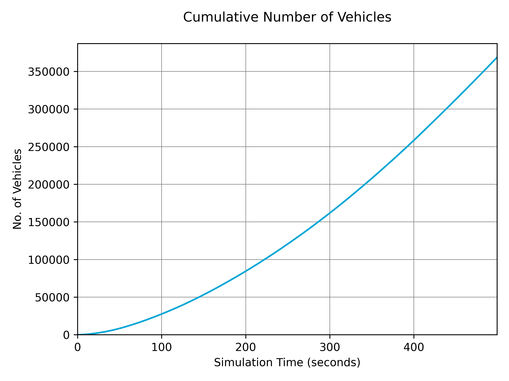
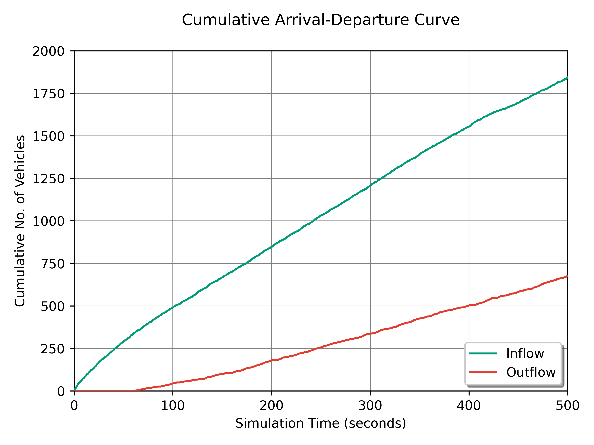
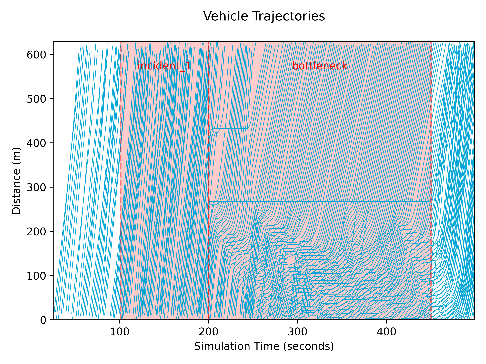

# Plotting Data

TUD-SUMO aims to provide plotting functions with each feature. These are specifically tailored to the data collected in the `sim_data` and have a unified and standardised form. It has also been designed to facilitate plotting a large number of graphs, and graphs for different scenarios. All graphs for a specific simulation can, therefore, be saved with the same label and in specific locations.

## Plotter Class

The `Plotter` object is initialised with a corresponding active `Simulation` object or data file from previous runs. This is the only required parameter, although the other settings are:

  - `sim_label`: Adds a string as a label to the title of all plots.
  - `time_unit`: Sets the time scale used for all plots, either '<i>steps</i>', '<i>s</i>' (seconds), '<i>m</i>' (minutes) or '<i>hr</i>' (hours).
  - `save_fig_loc`: Sets the location for all saved figures.
  - `save_fig_dpi`: Resolution for saved figures.
  - `overwrite_figs`: Denotes whether to overwrite old figures when saving.

```python
from tud_sumo.plot import Plotter

# Simple initialisation
plt = Plotter(my_sim)

plt = Plotter(simulation="example_data.json",
              sim_label="Example",
              time_unit="hr",
              save_fig_loc="figs/",
              save_fig_dpi=400,
              overwrite_figs=False
             )
```

## Plotting Graphs

### Display & Saving Graphs

All graphs can be saved or shown onscreen with the `save_fig` parameter. If a valid filename is given, the resulting plot is saved, otherwise, it is shown onscreen. An example is shown below.

```python
# Display trajectories graph
plt.plot_trajectories(["edge_1", "edge_2", "edge_3"])

# Save trajectories graph to 'figs/trajectories.png'
plt.plot_trajectories(["edge_1", "edge_2", "edge_3"], save_fig="figs/trajectories.png")
```

### Common Parameters

Whenever possible, all plotting functions include `time_range` and `show_events` parameters. By default, graphs are plotted for the data throughout the whole simulation. `time_range` can be used to plot a specific duration within the simulation, and is defined in <b>in plotter time units</b>, ie. hours or minutes. If `show_events` is set to true, graphs will display times with active events with a shaded region. Examples of these are shown below.


### Colours

Certain functions use a `plt_colour` parameter that can be used to set the line colour when plotting graphs. All matplotlib colours are valid parameters. By default, TUD-SUMO uses the [TU Delft colour palette](https://www.tudelft.nl/huisstijl/bouwstenen/kleur) as below, and so these colours are also valid parameters.


## Plotting Functions

!!! Warning

    Please note that some functions will require objects to be created or tracked.

All (current) plotting functions are listed in the table below. Several graph examples are shown beneath the table.

| Function                       | Plot                                                                                                               |
|--------------------------------|--------------------------------------------------------------------------------------------------------------------|
| `plot_vehicle_data()`          | Network-wide vehicle data, either number of vehicles, number of waiting vehicles, Total Time Spent (TTS) or delay. |
| `plot_detector_data()`         | Detector specific data, either speeds, vehicle counts or occupancies.                                              |
| `plot_junc_flows()`            | Either junction inflow & outflow, or number of vehicles in an intersection.                                        |
| `plot_tl_colours()`            | Traffic light signal settings over time.                                                                           |
| `plot_od_demand()`             | Flow rate, either for a route or an OD pair. Note, this only includes data added in TUD-SUMO.                      |
| `plot_od_trip_times()`         | Average trip times for OD pairs.                                                                                   |
| `plot_trip_time_histogram()`   | Trip time distribution as a histogram.                                                                             |
| `plot_throughput()`            | Rate of completed trips in vehicles per hour.                                                                      |
| `plot_cumulative_curve()`      | Cumulative curve, either for network-wide data or for specific inflow and outflow detectors.                       |
| `plot_space_time_diagram()`    | Space-time diagram based on `step_vehicles` data in tracked edges.                                                 |
| `plot_trajectories()`          | Trajectories based on `step_vehicles` data in tracked edges. Use `lane_idx` to plot lane-specific data.            |
| `plot_fundamental_diagram()`   | Fundamental diagram based on `step_vehicles` data in tracked edges.                                                |
| `plot_rm_rate()`               | Metering rate for a ramp metering controller.                                                                      |
| `plot_rm_queuing()`            | On-ramp queue length/spillback for a ramp meter, if tracked.                                                       |
| `plot_rm_rate_queuing()`       | Metering rate and queue length/spillback for a ramp meter, if tracking queuing.                                    |
| `plot_rm_rate_detector_data()` | Metering rate and corresponding detector data.                                                                     |
| `plot_vsl_data()`              | Variable speed limit controller settings and average speeds on controlled edges.                                   |
| `plot_rg_data()`               | Number of vehicles diverted by a route guidance controller.                                                        |

## Example Graphs

1. `plt.plot_vehicle_data(data_key"no_vehicles", plot_cumulative=True, show_events=False, save_fig="n_vehicles.png")` 

2. `plt.plot_junc_flows(junc_id="utsc", show_events=False, save_fig="junc_flows.png")` 

3. `plt.plot_tl_colours(junc_id="utsc", save_fig="tl_colours.png")` 

4. `plt.plot_cumulative_curve(show_events=False, save_fig="cumulative_curve.png")` 

5. `plt.plot_trajectories(["126730026", "1191885773", "1191885771", "126730171", "1191885772", "948542172", "70944365", "308977078", "1192621075"], lane_idx=0, save_fig="trajectories.png", show_events=False)` 

6. `plt.plot_rm_rate(rm_id="crooswijk_meter", show_events=False, save_fig="rm_rate.png")` 

7. `plt.plot_vsl_data(vsl_id="vsl", show_events=False, save_fig="vsl_data.png")` 